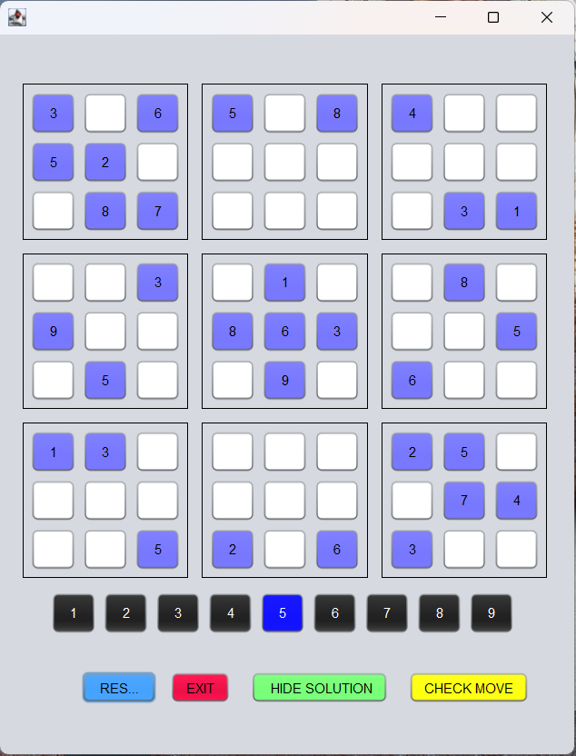
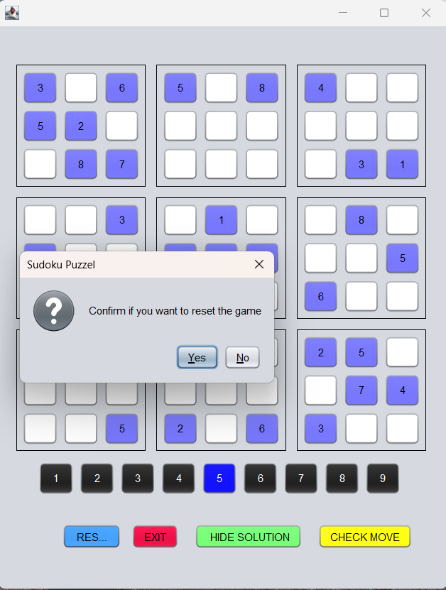
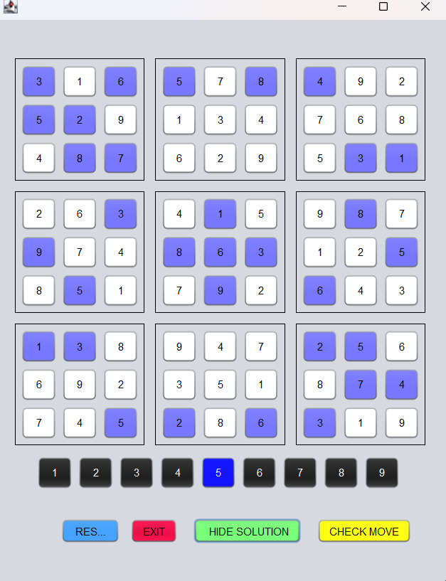
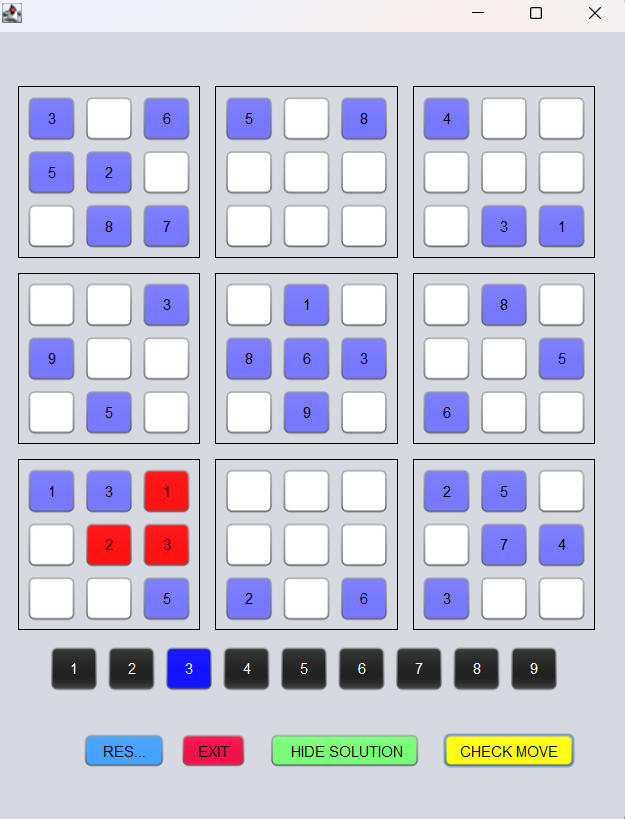
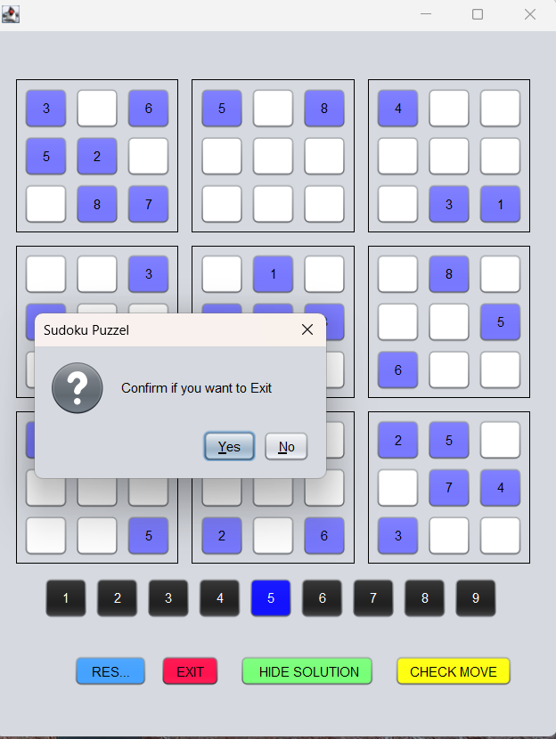

# SudokuByNeha
SudokuSolver is a Java application developed using Apache NetBeans that provides a user-friendly interface to solve Sudoku puzzles. The project aims to implement an efficient Sudoku solving algorithm and offer a seamless experience for users to interact with the application.

A user can click on Number buttons(1-9) to select any numbers then fill in empty boxes provided.
Use Reset button to reset game.

Use Solution button to see solution and to hide solution again click on Hide solution button.

Use Exit button to Exit the game.

Use Check button to Check moves in the game.

Project Snips

